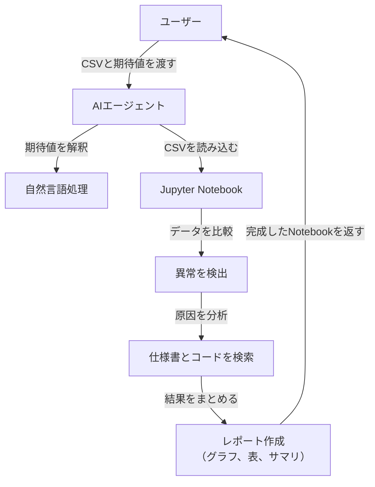

# AIアルゴリズム異常解析システム

[](https://opensource.org/licenses/MIT)
[](https://www.python.org/downloads/)
[](https://langchain.com/)

## 📋 概要

AIアルゴリズム異常解析システムは、アルゴリズムが生成した結果（CSV形式）とユーザーが期待する結果（自然言語）を比較し、異常を検出・分析するシステムです。AIエージェントが自律的に解析を行い、Jupyter Notebookに視覚的でわかりやすいレポートを生成します。

## ✨ 主な機能

- **🔍 異常検出**: CSVデータと自然言語の期待値を比較し、異常箇所を特定
- **🤖 AIエージェント**: LangChainを活用した自律的な解析処理
- **📊 視覚化**: Jupyter Notebookでのグラフ・表による結果表示
- **📝 自然言語対応**: 複雑な期待値（合計、パターン、条件付き）を解釈
- **🔧 原因分析**: 仕様書とソースコードを基に異常の根本原因を特定
- **📋 レポート生成**: 初心者にも分かりやすい解析レポートの自動生成

## 🎯 対象ユーザー

- **初心者**: プログラミングやデータ分析の知識が少ない人でも簡単に使用可能
- **開発者**: アルゴリズムの動作検証やデバッグを行いたい人
- **研究者**: アルゴリズムの性能評価や異常検出を行いたい人

## 🏗️ システム構成



## 🛠️ 技術スタック

- **AI/ML**: LangChain, OpenAI ChatGPT
- **データ処理**: Pandas, NumPy
- **可視化**: Matplotlib, Seaborn
- **開発環境**: Jupyter Notebook, Python 3.8+
- **検索**: RAG (Retrieval-Augmented Generation)
- **自然言語処理**: OpenAI GPTモデル

## 📦 インストール

### 前提条件

- Python 3.8以上
- Jupyter Notebook
- OpenAI API キー

### セットアップ

1. リポジトリをクローン
```bash
git clone https://github.com/your-username/ai_analysis_engine.git
cd ai_analysis_engine
```

2. 依存関係をインストール
```bash
pip install -r requirements.txt
```

3. 環境変数を設定
```bash
export OPENAI_API_KEY="your-api-key-here"
```

## 🚀 使用方法

### 1. データ準備

以下のファイルを準備してください：

- **CSVファイル**: アルゴリズムの検知結果
- **仕様書**: アルゴリズムの動作仕様（Markdown形式）
- **ソースコード**: アルゴリズムの実装（Python）
- **期待値**: 自然言語で記述された期待する結果

### 2. システム起動

```python
from langchain_mcp_adapters import MultiServerMCPClient

# Jupyter Notebookに接続
client = MultiServerMCPClient(
    servers={
        "jupyter": {
            "transport": "streamable_http",
            "server_url": "http://localhost:8888",
            "document_url": "http://localhost:8888",
            "runtime_url": "http://localhost:8888",
            "document_id": "analysis.ipynb",
            "document_token": "YOUR_TOKEN",
            "runtime_token": "YOUR_TOKEN",
        }
    }
)
tools = client.load_tools()
```

### 3. 解析実行

```python
# 期待値を解釈
expected_value = "フレーム10では値が5であるべき"

# データ解析
code = """
import pandas as pd
df = pd.read_csv('data.csv')
expected = {'frame': 10, 'expected_value': 5}
result = df[df['frame'] == expected['frame']]
result['difference'] = result['value'] - expected['expected_value']
"""

# 結果をNotebookに追加
tools['insert_execute_code_cell'](code)
```

## 📊 入力例

### CSVファイル (data.csv)
```csv
frame,value
1,3
2,4
10,15
```

### 仕様書 (spec.md)
```markdown
## 仕様
- フレーム10の値は5になるべき
- 値は単調増加するべき
```

### ソースコード (source.py)
```python
def detect_value(frame):
    if frame == 10:
        return 15  # 仕様では5のはずがバグで15
    return frame
```

### 期待値
```
フレーム10では値が5であるべき
```

## 📈 出力例

Jupyter Notebookに以下の内容が生成されます：

- **異常箇所**: フレーム10で値が15（期待値は5）
- **差分**: 10
- **原因**: ソースコードの条件分岐ミス
- **グラフ**: 異常の視覚化
- **サマリ**: 初心者向けの解説

## 🔧 設定

### 環境変数

| 変数名 | 説明 | 必須 |
|--------|------|------|
| `OPENAI_API_KEY` | OpenAI APIキー | ✅ |
| `JUPYTER_TOKEN` | Jupyter Notebookトークン | ✅ |

### 設定ファイル

`config.yaml`で詳細設定が可能です：

```yaml
jupyter:
  server_url: "http://localhost:8888"
  document_id: "analysis.ipynb"
  
openai:
  model: "gpt-4"
  temperature: 0.1
  
analysis:
  max_anomalies: 10
  visualization: true
```

## 🤝 貢献

プロジェクトへの貢献を歓迎します！

1. このリポジトリをフォーク
2. 機能ブランチを作成 (`git checkout -b feature/amazing-feature`)
3. 変更をコミット (`git commit -m 'Add amazing feature'`)
4. ブランチにプッシュ (`git push origin feature/amazing-feature`)
5. プルリクエストを作成

## 📝 ライセンス

このプロジェクトはMITライセンスの下で公開されています。詳細は[LICENSE](LICENSE)ファイルを参照してください。

## 📞 サポート

- **Issues**: [GitHub Issues](https://github.com/your-username/ai_analysis_engine/issues)
- **ドキュメント**: [詳細仕様書](仕様書_サンプル_byGrok.md)
- **メール**: support@example.com

## 🗓️ 更新履歴

### v1.0.0 (2025-08-05)
- 初回リリース
- 基本的な異常検出機能
- Jupyter Notebook統合
- 自然言語処理対応

## 🙏 謝辞

- [LangChain](https://langchain.com/) - AIエージェントフレームワーク
- [OpenAI](https://openai.com/) - 自然言語処理API
- [Jupyter](https://jupyter.org/) - ノートブック環境

---

**開発者**: AI Analysis Engine Team  
**最終更新**: 2025年8月5日 