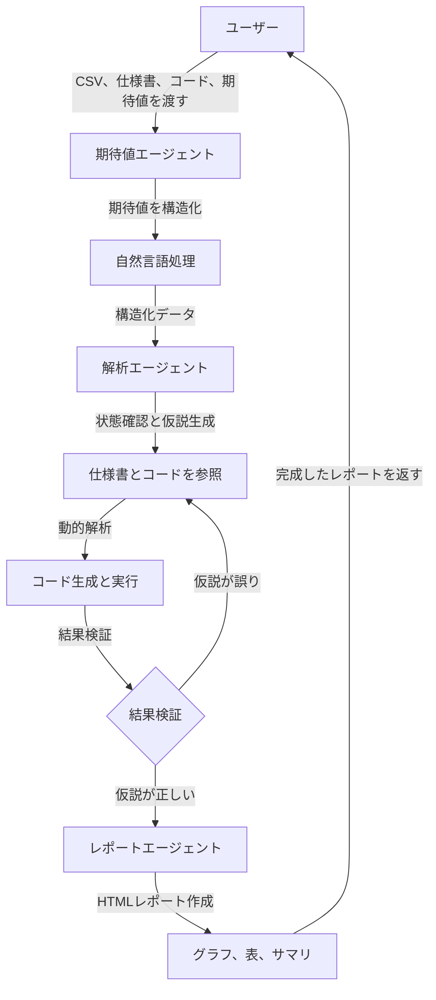

# AIアルゴリズム異常解析システム 仕様書（改訂版）

この仕様書は、AIアルゴリズム異常解析システムの設計を詳細に説明します。ユーザーが提供するCSVデータ、仕様書、ソースコード、自然言語の期待値をもとに、マルチエージェント構成のコーディングエージェントが課題箇所の状態を確認し、仕様書と照らし合わせて仮説を立て、解析条件（例: 参照列、解析指標、範囲）を動的に調整しながらコードを生成・実行します。結果検証で仮説が間違っていた場合、仮説生成にループバックします。結果はHTML形式で、初心者にもわかりやすいレポートとして出力されます。

---

## 目次
1. [システム概要](#1-システム概要)  
2. [システムの流れ](#2-システムの流れ)  
3. [入力と出力](#3-入力と出力)  
4. [主要コンポーネント](#4-主要コンポーネント)  
5. [機能の詳細](#5-機能の詳細)  
6. [システムの動かし方](#6-システムの動かし方)  
7. [サンプルコード](#7-サンプルコード)  
8. [初心者向け解説](#8-初心者向け解説)  
9. [まとめ](#9-まとめ)  

---

## 1. システム概要

### 1.1 目的
このシステムは、アルゴリズムの検知結果（CSV形式）とユーザーの期待値（自然言語）を比較し、異常箇所を特定します。マルチエージェント構成のコーディングエージェントが、仕様書やソースコードを参照して課題の仮説を立て、解析条件を動的に調整しながらコードを生成・実行します。結果検証で仮説が誤っている場合、仮説生成にループバックし、精度を向上させます。結果はHTML形式のレポートとして出力されます。

### 1.2 対象ユーザー
- **初心者**: プログラミングやデータ分析の知識が少ない人。
- **開発者**: アルゴリズムの動作検証やデバッグを行いたい人。

### 1.3 主な特徴
- **自然言語対応**: 定型句テンプレートとLLMで期待値を安定して解釈。
- **マルチエージェント**: 期待値解釈、データ解析、仮説生成、レポート作成を分担。
- **動的解析**: 参照列、解析指標、範囲を状況に応じて調整。
- **仮説のループバック**: 結果検証で仮説が誤っていた場合、仮説生成に再挑戦。
- **安定性重視**: 段階的処理と中間確認でエラーを軽減。
- **わかりやすい出力**: HTMLレポートにグラフ、表、初心者向けサマリを統合。

---

## 2. システムの流れ

### 2.1 全体の流れ
1. **データ入力**: ユーザーがCSVファイル、仕様書、ソースコード、自然言語の期待値を提供。
2. **期待値解釈**: 期待値エージェントが自然言語を構造化データに変換。
3. **状態確認と仮説生成**: 解析エージェントがデータと仕様書を比較し、異常の仮説を生成。
4. **動的解析**: 解析エージェントが適切な列、指標、範囲を選び、コードを生成・実行。
5. **結果検証**: 解析結果と仮説を検証。仮説が誤っている場合、仮説生成にループバック。
6. **レポート生成**: レポートエージェントが結果をHTML形式でまとめ、グラフや表を追加。
7. **出力**: 完成したレポートをユーザーに提供。

### 2.2 フローチャート


---

## 3. 入力と出力

### 3.1 入力
システムが処理に必要とするデータは以下の4つです：
1. **CSVファイル**: アルゴリズムの検知結果。
   - 例: `data.csv`
     ```
     frame,value,category
     1,3,A
     2,4,B
     10,15,A
     ```
2. **仕様書（Markdown）**: アルゴリズムの動作仕様。
   - 例: `spec.md`
     ```markdown
     ## 仕様
     - フレーム10の値は5であるべき。
     - categoryがAの場合、値は10未満であるべき。
     ```
3. **ソースコード（Python）**: アルゴリズムの実装。
   - 例: `source.py`
     ```python
     def detect_value(frame, category):
         if frame == 10:
             return 15  # 仕様では5のはずがバグで15
         return frame
     ```
4. **期待値（自然言語）**: ユーザーの期待する結果。
   - 例: 「フレーム10では値が5であるべき」「categoryがAの場合、値は10未満」

### 3.2 出力
- **レポート（HTML）**: 解析結果をまとめたファイル。
  - **内容**:
    - 異常箇所（例: フレーム10で値が15、category Aで値が10以上）。
    - 期待値との差（例: 差分 = 10）。
    - 仮説（例: コードの条件分岐ミス、カテゴリ条件無視）。
    - グラフや表による視覚化。
    - 初心者向けサマリ。
  - **例**:
    ```
    # 異常解析レポート

    ## 概要
    - データ: data.csv
    - 期待値: "フレーム10の値は5であるべき" "categoryがAの場合、値は10未満"

    ## 異常の詳細
    ### 異常1
    - **場所**: フレーム10
    - **検出値**: 15
    - **期待値**: 5
    - **差分**: 10
    - **仮説**: `detect_value`関数の条件分岐で誤った値（15）を返している。
    - **グラフ**: [フレームごとの値と期待値の差分]

    ### 異常2
    - **場所**: フレーム10、category A
    - **検出値**: 15
    - **期待値**: 10未満
    - **仮説**: カテゴリ条件がコードで考慮されていない。
    - **表**: [カテゴリごとの値の分布]

    ## サマリ
    - **初心者向け**: フレーム10で値が大きすぎます。コードにミスがあり、category Aの条件も無視されています。
    ```

---

## 4. 主要コンポーネント

### 4.1 マルチエージェント構成
- **期待値エージェント**:
  - **役割**: 自然言語の期待値を構造化データ（JSON）に変換。
  - **技術**: LangChain + OpenAI ChatGPTモデル。
- **解析エージェント**:
  - **役割**: データの状態確認、仮説生成、動的解析コードの生成・実行、結果検証後のループバック。
  - **技術**: LangChain + Pandas + AST解析。
- **レポートエージェント**:
  - **役割**: 解析結果をグラフや表とともにHTMLレポートにまとめる。
  - **技術**: Jinja2 + Matplotlib。

### 4.2 ツール
- **自然言語処理**: 定型句テンプレート＋LLMフォールバック。
- **データ処理**: PandasでCSVを処理。
- **グラフ作成**: Matplotlibで視覚化。
- **レポート生成**: HTMLテンプレート（Jinja2）。
- **検索（RAG）**: 仕様書やコードから情報を抽出。
- **コード解析**: AST解析でソースコードのロジックを分析。

---

## 5. 機能の詳細

### 5.1 自然言語の期待値の解釈
- **対応範囲**
  - **単一値**: 「フレーム10の値は5であるべき」
  - **集計**: 「フレーム1から10の合計が50であるべき」
  - **パターン**: 「値はフレームごとに単調増加するべき」
  - **条件付き**: 「categoryがAの場合、値は10未満」

- **実装方法**
  - **定型句テンプレート**: 「XがYならZ」「Xの合計はZ」などの形式を優先解析。
  - **LLMフォールバック**: 非定型な入力はChatGPTでJSON形式に構造化。
  - **曖昧性対応**: 不明瞭な入力の場合、ユーザーに具体性を求めるフィードバック。

- **例**
  - **入力**: 「categoryがAの場合、値は10未満であるべき」
  - **解釈**: `{"condition": "category == 'A'", "constraint": "value < 10"}`
  - **処理**: Pandasで`df.loc[df['category'] == 'A', 'value'] < 10`を評価。

### 5.2 課題箇所の状態確認と仮説生成
- **プロセス**
  1. **状態確認**: CSVデータの異常箇所を特定（例: フレーム10の値、category A）。
  2. **仮説生成**: 仕様書とコードをRAGで検索し、異常の原因を推測。
  3. **構造化比較**: 仕様書をJSON形式に変換し、コードの出力と比較。
  4. **中間確認**: 仮説の妥当性をログに記録。

- **例**
  - **状態**: フレーム10で値15、category A。
  - **仕様書**: 「フレーム10の値は5」「category Aは10未満」
  - **コード**: `if frame == 10: return 15`
  - **仮説**: 条件分岐の戻り値ミス、カテゴリ条件の未実装。

### 5.3 動的解析
- **プロセス**
  - **列選択**: 仕様書や期待値に基づき、関連列（例: `frame`, `value`, `category`）を選択。
  - **指標調整**: 平均、最大値、単調性などを動的に適用。
  - **範囲調整**: フレーム範囲やカテゴリを絞り込む。
  - **コード生成**: 解析エージェントがPandasコードを生成・実行。
  - **中間確認**: 解析結果をログに記録。

- **例**
  - **期待値**: 「category Aのフレーム1-10の値は単調増加」
  - **コード生成**:
    ```python
    subset = df.loc[(df['category'] == 'A') & (df['frame'].between(1, 10)), 'value']
    is_monotonic = subset.is_monotonic_increasing
    ```

### 5.4 結果検証とループバック
- **プロセス**
  - **検証**: 解析結果と仮説を比較（例: 異常が仕様書と一致するか）。
  - **ループバック**: 仮説が誤っている場合（例: 異常の原因が特定できない）、解析エージェントが新たな仮説を生成し、解析を再実行。
  - **判定基準**: 仕様書との不一致度やコードの出力との差異をスコアリング。
  - **ログ**: 検証結果とループバックの理由を記録。

- **例**
  - **検証**: フレーム10の値15が仕様（5）と不一致。
  - **仮説**: 条件分岐ミス。
  - **結果**: 仮説がコードと一致しない場合、別の仮説（例: 入力データエラー）を生成し再解析。

### 5.5 レポートの構造とカスタマイズ性
- **構造**
  ```
  # 異常解析レポート
  ## 概要
  - データ: data.csv
  - 期待値: "フレーム10の値は5であるべき" "categoryがAの場合、値は10未満"
  ## 異常の詳細
  ### 異常1
  - **場所**: フレーム10
  - **検出値**: 15
  - **期待値**: 5
  - **差分**: 10
  - **仮説**: `detect_value`関数の条件分岐ミス
  - **グラフ**: [差分グラフ]
  ### 異常2
  - **場所**: フレーム10、category A
  - **検出値**: 15
  - **期待値**: 10未満
  - **仮説**: カテゴリ条件がコードで考慮されていない
  - **表**: [カテゴリごとの値の分布]
  ## サマリ
  - 初心者向け: フレーム10で値が大きすぎます。コードにミスがあり、category Aの条件も無視されています。
  ```

- **カスタマイズ性**
  - **出力形式**: HTML（デフォルト）、PDF（オプション）。
  - **オプション**: グラフの種類、詳細度。
  - **テンプレート**: HTMLテンプレートをカスタマイズ可能。

### 5.6 マルチエージェントの自律性
- **期待値エージェント**: 自然言語を構造化データに変換。
- **解析エージェント**: 状態確認、仮説生成、コード生成・実行、結果検証、ループバック。
- **レポートエージェント**: 結果を視覚化し、レポートを生成。
- **中間確認**: 各ステップの出力をログに記録し、必要に応じてユーザーに確認を求める。

---

## 6. システムの動かし方

### 6.1 データ準備
1. CSVファイル（例: `data.csv`）。
2. 仕様書（例: `spec.md`）とソースコード（例: `source.py`）。
3. 期待値を記述（例: 「フレーム10では値が5であるべき」「categoryがAの場合、値は10未満」）。

### 6.2 システム起動
1. マルチエージェントを初期化し、解析を依頼。
2. 各エージェントが段階的に処理を実行し、結果検証で仮説が誤っている場合は仮説生成にループバック。
3. 最終的にレポートエージェントがHTMLレポートを生成。

### 6.3 結果確認
- 生成されたHTMLレポートを確認。

---

## 7. サンプルコード

以下は、マルチエージェント構成のサンプルコードです。実際の実装では、環境に応じた調整が必要です。

### 7.1 マルチエージェントの設定
```python
from langchain.agents import initialize_agent, AgentType
from langchain.tools import Tool
from langchain.chat_models import ChatOpenAI
import pandas as pd
import matplotlib.pyplot as plt
from jinja2 import Template
import json
import re

# 期待値エージェントのツール
def parse_expectation(expectation_text):
    templates = {
        r"(\w+)が(\w+)なら(\w+)([<>=]\d+)": lambda m: {"column": m[0], "condition": m[1], "constraint": f"{m[2]}{m[3]}"},
        r"(\w+)の合計は(\d+)": lambda m: {"column": m[0], "operation": "sum", "value": int(m[1])},
    }
    structured = []
    for exp in expectation_text.split("、"):
        for pattern, parser in templates.items():
            match = re.match(pattern, exp.strip())
            if match:
                structured.append(parser(match.groups()))
                break
        else:
            llm = ChatOpenAI(model="gpt-4")
            prompt = f"Convert to JSON: {exp}"
            structured.append(json.loads(llm.predict(prompt)))
    return structured

# 解析エージェントのツール
def analyze_data(data_path, structured_expectation):
    df = pd.read_csv(data_path)
    results = []
    for exp in structured_expectation:
        if "condition" in exp:
            condition = exp["condition"]
            constraint = exp["constraint"]
            result = df.query(condition)
            violations = result[eval(f"result['value'] {constraint}")]
            results.append({"condition": condition, "violations": violations.to_dict()})
        elif "operation" in exp:
            column = exp["column"]
            value = exp["value"]
            actual = df[column].sum()
            results.append({"operation": "sum", "expected": value, "actual": actual})
    return results

def generate_hypothesis(analysis_results, spec_path, code_path):
    with open(spec_path) as f:
        spec = f.read()
    with open(code_path) as f:
        code = f.read()
    llm = ChatOpenAI(model="gpt-4")
    prompt = f"""
    Analysis results: {analysis_results}
    Specification: {spec}
    Source code: {code}
    Generate a hypothesis for the anomalies.
    """
    return llm.predict(prompt)

def verify_results(analysis_results, hypothesis):
    llm = ChatOpenAI(model="gpt-4")
    prompt = f"""
    Analysis results: {analysis_results}
    Hypothesis: {hypothesis}
    Verify if the hypothesis explains the anomalies. Return JSON: {{"valid": bool, "reason": str}}
    """
    result = json.loads(llm.predict(prompt))
    return result

# レポートエージェントのツール
def create_graph(data):
    plt.plot(data[0]["violations"]["frame"], data[0]["violations"]["value"], marker='o')
    plt.title('Violations in Expected Values')
    plt.xlabel('Frame')
    plt.ylabel('Value')
    plt.savefig('graph.png')
    plt.close()
    return 'graph.png'

def generate_report(data, graph_path, hypothesis):
    with open('template.html') as f:
        template = Template(f.read())
    report = template.render(data=data, graph=graph_path, hypothesis=hypothesis, summary="初心者向け: 値が期待と異なります。コードにミスがある可能性があります。")
    with open('report.html', 'w') as f:
        f.write(report)
    return 'report.html'

tools = [
    Tool(name="parse_expectation", func=parse_expectation, description="Parse natural language expectation into structured data"),
    Tool(name="analyze_data", func=analyze_data, description="Analyze CSV data based on structured expectations"),
    Tool(name="generate_hypothesis", func=generate_hypothesis, description="Generate hypothesis for anomalies"),
    Tool(name="verify_results", func=verify_results, description="Verify analysis results and hypothesis"),
    Tool(name="create_graph", func=create_graph, description="Create a graph from analysis results"),
    Tool(name="generate_report", func=generate_report, description="Generate an HTML report"),
]

# エージェントの初期化
llm = ChatOpenAI(model="gpt-4")
expectation_agent = initialize_agent(tools[:1], llm, agent_type=AgentType.ZERO_SHOT_REACT_DESCRIPTION)
analysis_agent = initialize_agent(tools[1:4], llm, agent_type=AgentType.ZERO_SHOT_REACT_DESCRIPTION)
report_agent = initialize_agent(tools[4:], llm, agent_type=AgentType.ZERO_SHOT_REACT_DESCRIPTION)
```

### 7.2 マルチエージェントの実行
```python
expectation_text = "フレーム10では値が5であるべき、categoryがAの場合値は10未満"
data_path = "data.csv"
spec_path = "spec.md"
code_path = "source.py"

# 期待値エージェント
structured_expectation = expectation_agent.run(f"Parse: {expectation_text}")

# 解析エージェント
max_attempts = 3
for attempt in range(max_attempts):
    analysis_results = analysis_agent.run(f"Analyze {data_path} with expectations: {structured_expectation}")
    hypothesis = analysis_agent.run(f"Generate hypothesis with results: {analysis_results}, spec: {spec_path}, code: {code_path}")
    verification = analysis_agent.run(f"Verify results: {analysis_results}, hypothesis: {hypothesis}")
    verification = json.loads(verification)
    if verification["valid"]:
        break
    print(f"Attempt {attempt + 1}: Hypothesis invalid, reason: {verification['reason']}")
else:
    print("Max attempts reached. Using last hypothesis.")

# レポートエージェント
graph_path = report_agent.run(f"Create graph with data: {analysis_results}")
report_path = report_agent.run(f"Generate HTML report with data: {analysis_results}, graph: {graph_path}, hypothesis: {hypothesis}")
```

### 7.3 HTMLテンプレート（`template.html`）
```html
<!DOCTYPE html>
<html>
<head>
    <title>異常解析レポート</title>
    <style>
        body { font-family: Arial, sans-serif; }
        h1, h2 { color: #333; }
        table { border-collapse: collapse; width: 100%; }
        th, td { border: 1px solid #ddd; padding: 8px; }
        img { max-width: 100%; }
    </style>
</head>
<body>
    <h1>異常解析レポート</h1>
    <h2>概要</h2>
    <p>データ: {{ data.source }}</p>
    <p>期待値: {{ data.expectation }}</p>
    <h2>異常の詳細</h2>
    
    <h3>異常: {{ result.condition or result.operation }}</h3>
    <table>
        <tr><th>場所</th><th>検出値</th><th>期待値</th></tr>
        
        <tr><td>{{ row.frame }}</td><td>{{ row.value }}</td><td>{{ result.constraint or result.expected }}</td></tr>
        
    </table>
    
    <h2>仮説</h2>
    <p>{{ hypothesis }}</p>
    <h2>グラフ</h2>
    
    <h2>サマリ</h2>
    <p>{{ summary }}</p>
</body>
</html>
```

### 7.4 サンプル実行結果
- **入力**:
  - CSV: `data.csv`（上記例）
  - 期待値: 「フレーム10では値が5であるべき」「categoryがAの場合、値は10未満」
  - 仕様書: 「フレーム10の値は5」「category Aは10未満」
  - ソースコード: `detect_value`関数
- **出力**: `report.html`
  - 内容: フレーム10の異常（値15、差分10）、category Aの違反（値15）、仮説（条件分岐ミス、カテゴリ条件無視）、折れ線グラフ、初心者向けサマリ。

---

## 8. 初心者向け解説
- **マルチエージェント**: 複数のAI助手が役割分担（期待値解釈、解析、レポート作成）。
- **仮説ループバック**: 仮説が間違っていた場合、自動で新しい仮説を試す。
- **自然言語処理**: あなたの言葉を定型文やAIで理解。
- **Pandas**: 表データを処理。
- **Matplotlib**: グラフを作成。
- **HTMLレポート**: ブラウザで確認できる、わかりやすい結果。

---

## 9. まとめ
このシステムは、マルチエージェント構成により、CSVデータ、仕様書、ソースコード、自然言語の期待値から異常を解析します。結果検証で仮説が誤っている場合、仮説生成にループバックし、精度を向上させます。各エージェントが期待値解釈、状態確認、仮説生成、動的解析、レポート作成を分担し、段階的処理と中間確認で安定性を確保します。結果はHTML形式で、グラフ、表、初心者向けサマリを含むレポートとして提供されます。

---

## 10. 開発ロードマップ
1. **フェーズ1**: 期待値エージェントの実装（定型句テンプレート＋LLMフォールバック）。
2. **フェーズ2**: 解析エージェントの実装（状態確認、仮説生成、動的解析、ループバック）。
3. **フェーズ3**: レポートエージェントの実装（HTMLレポート生成）。
4. **フェーズ4**: 中間確認とエラーハンドリングの強化。
5. **フェーズ5**: ユーザーインターフェース（例: CLIやWeb UI）の追加。